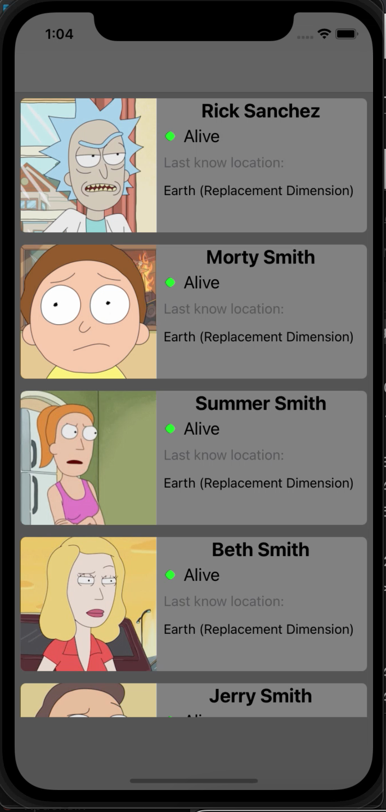
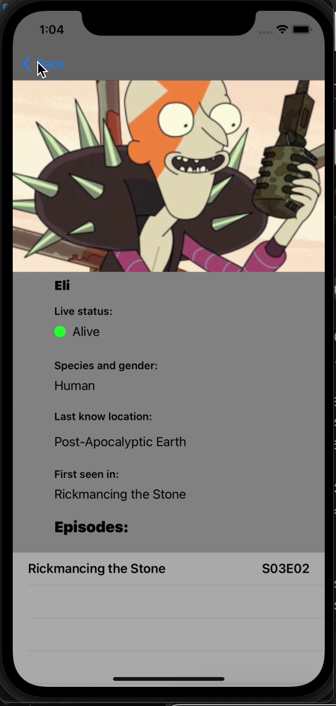

# RickAndMortyApiLibrary
API: https://rickandmortyapi.com/

Library of characters from Rick and Morty. Information is downloaded from the API and is a JSON file.

Implemented:

- Main table with characters
- Detailed information on the second screen
- Table of episodes where the character was
- Scrollview with pagination

Supports:

- UIKit
- Alamofire
- Kingfisher

